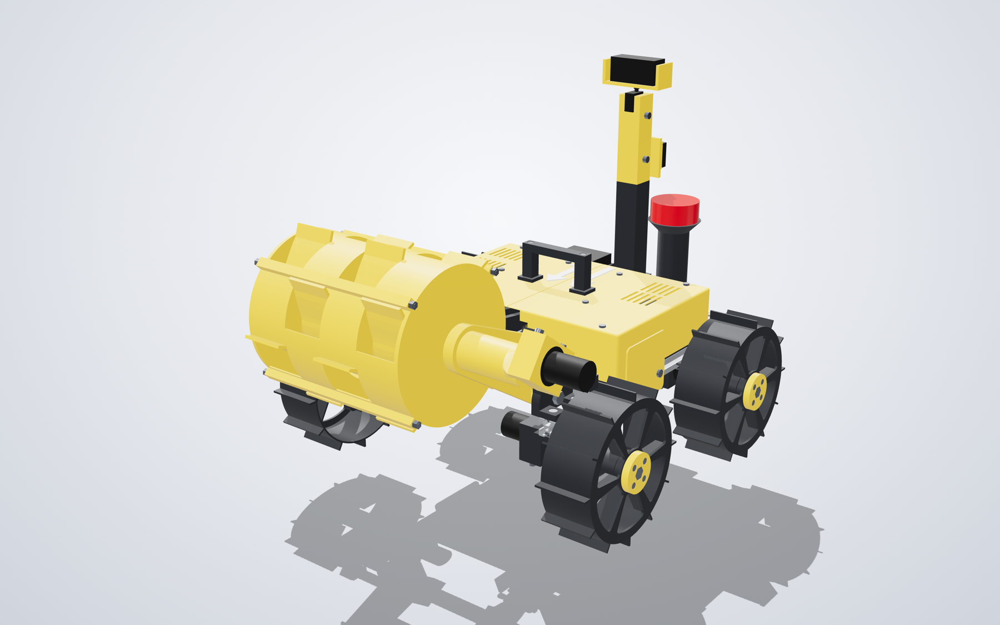
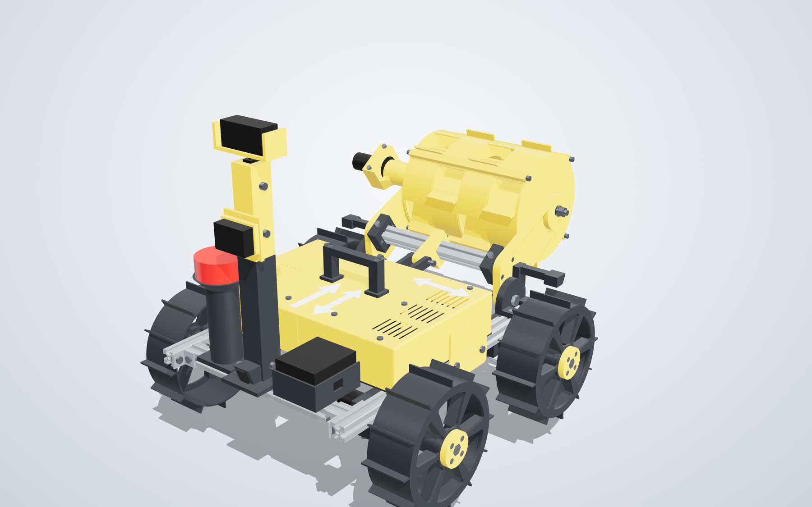
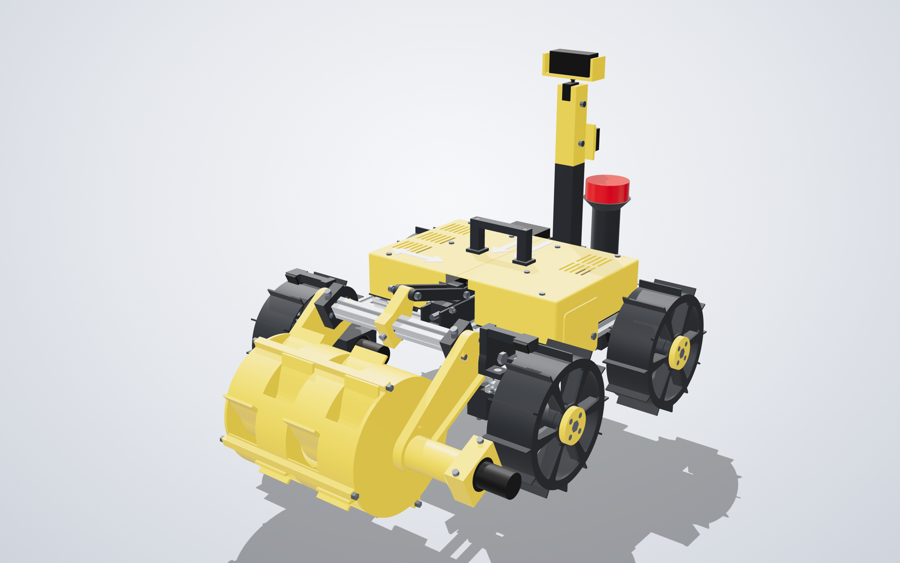
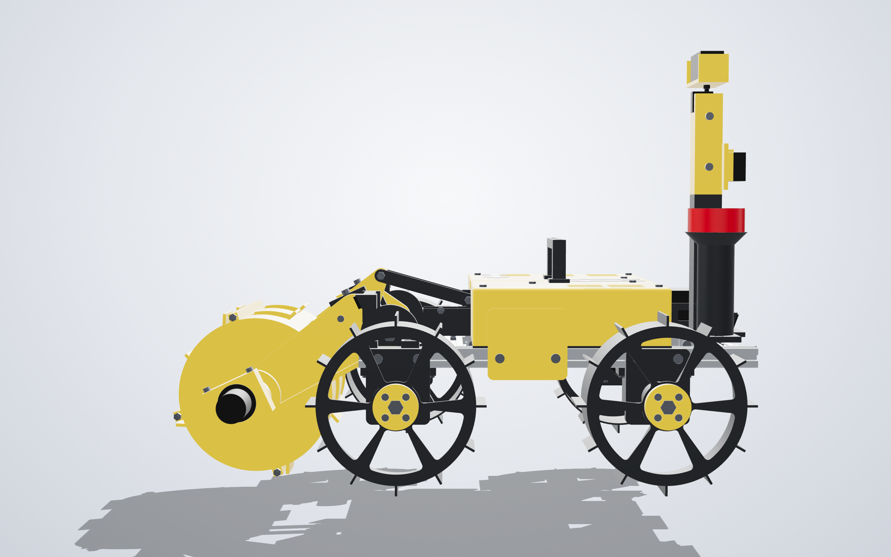
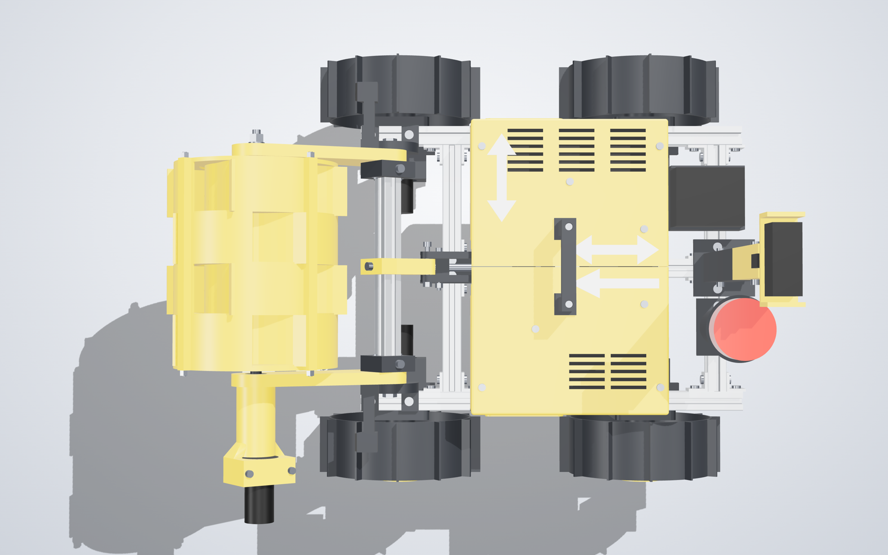
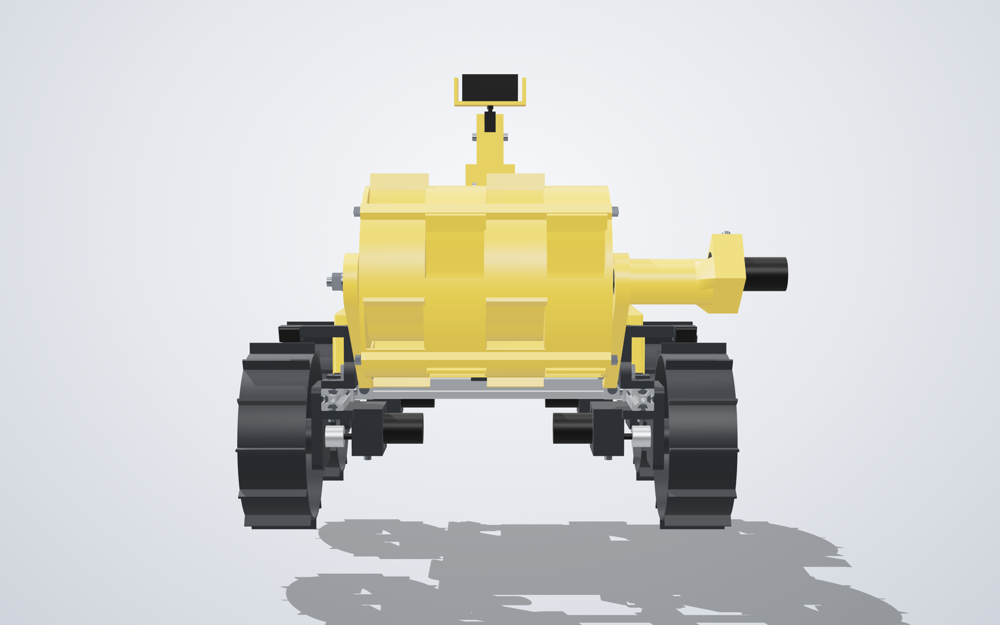
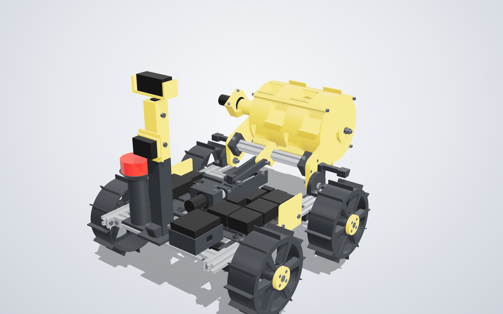
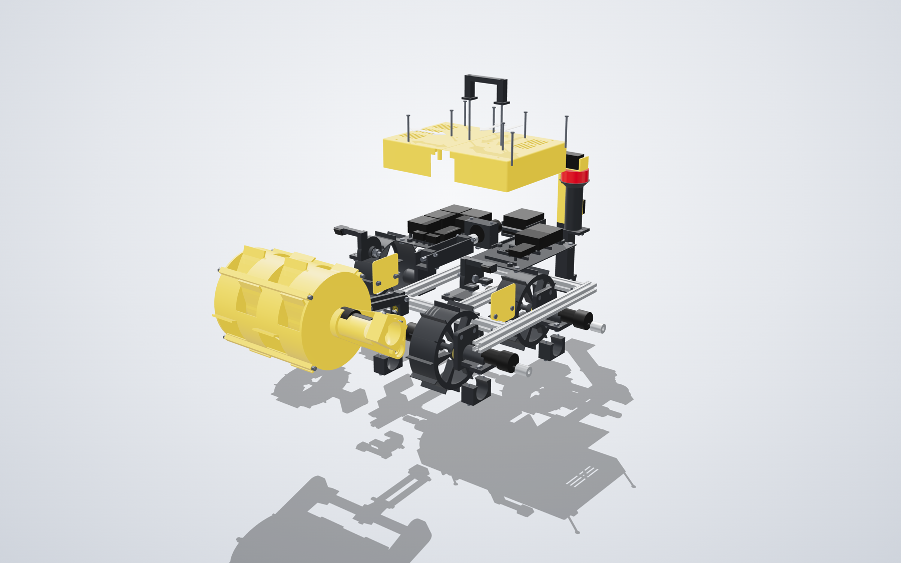
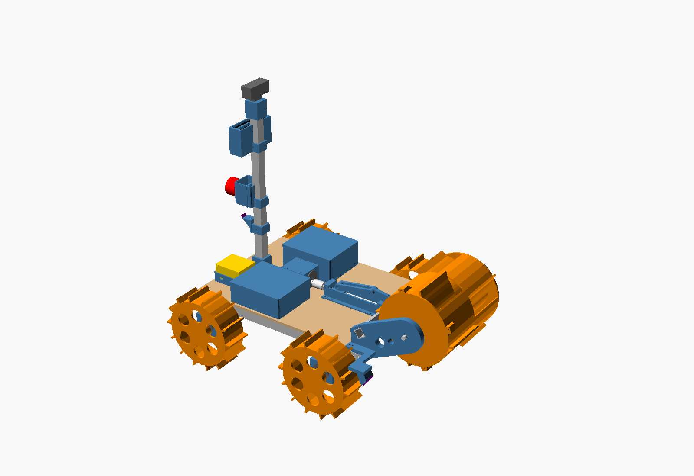

# CAC 2027 Rover

Our entry for the Caterpillar Autonomy Challenge 2027 (Shaastra, IIT Madras): a small,
light lunar-construction rover with a rotating bucket drum that crosses an obstacle
field, digs sand, carries it and builds a berm — first by remote control, then
autonomously.



## Rover v2 (2026-09-29)

v2 keeps v1's concept (four-wheel skid steer, drum digger on a lift arm) and re-engineers everything around it so a student team can build it with a 3D printer,
hand tools and **no drilling, no tapping and no heat-set inserts**. It is a parametric CAD model (`cad-v2/`, Python on the OpenCascade kernel that FreeCAD also uses)
with scripted checks for every claim below. v1 (`cad/`) is untouched.

- **Build it:** [docs/v2-build-guide.md](docs/v2-build-guide.md) (fit-test kit, print list, assembly, poses, mass, load paths)
- **Buy it:** [docs/v2-order-list.md](docs/v2-order-list.md) and [hardware/bom_v2.csv](hardware/bom_v2.csv)
- **What changed and where it departs from the plan:** [docs/v2-changelog.md](docs/v2-changelog.md); design spec in `docs/superpowers/specs/`

### At a glance

<!-- BEGIN:numbers -->
| What | Value |
| :--- | :--- |
| Stowed size (carry pose) | 601 x 478 x 445 mm (limit 1500 x 750 x 750) |
| Wheelbase, track | 260 mm, 380 mm between wheel centres |
| Empty mass | 7.94 kg = 7.69 kg modelled + 250 g wiring allowance (limit 8.0 kg, goal 7.5 kg) |
| Mass with a full drum | 10.04 kg (2.1 kg of sand) |
| Front-axle share | 53 % empty, 74 % with a full drum at the carry pose (limit 75 %; v1: 80 %) |
| Centre of gravity, empty | x = 29, y = 7, z = 157 mm (x from the frame centre, forward positive) |
| Arm range | press -28 deg (teeth 10 mm below grade), dig -25 deg (4 mm below), level 0, mid +20, carry +35 deg (teeth 147 mm up) |
| Lift | M8 x 1.25 rod with two brass nuts, stroke 59 mm, self-locking |
| Printed parts | 43 part types, 2.55 kg of PETG (v1 rule: volume x 1.27 x 0.75), largest 137 g, no supports |
| Purchased | 48 SKUs, 352 pieces; total budget INR 23,329 with filament (cap 25,000; v1 22,120) |
<!-- END:numbers -->

### Pictures

| | |
|---|---|
|  **Front left, carry pose.** Teeth 147 mm up, 601 x 478 x 445 mm stowed. |  **Rear right.** Vented two-half hood, carry handle, three arrow plates, E-stop, meter and camera on the mast. |
|  **Dig pose (-25 degrees).** The links and lever pass through the hood's front port. |  **Side, dig pose.** Teeth 4 mm below grade; the lift carriage is at 76.9 mm on the rod. |
|  **Top.** Seam down the centre line, vents over the drivers (right) and the Pi (left). |  **Front.** The drum motor sits in the left arm; the front cross member is the silver bar. |
|  **Hood off.** Power bay (right, by the battery) and compute bay (left) on the removable tray; lift rod and motor in the middle. |  **Exploded.** Hood and handle, electronics, frame, drive modules, excavator and tower pulled apart. |

An interactive viewer (arm poses, explode slider, hood and fastener toggles, hover for part names) is built by `python tasks.py render` in `cad-v2/` as `out/rover_v2_viewer.html` (12 MB, not stored in git).

### Why it is built this way

| What we did | Why |
|---|---|
| Kept the drum digger, four-wheel skid steer and the same electronics | A light rover cannot shove sand; a spinning drum takes small bites, carries the load inside and dumps by reversing. Nothing to test a new concept against before the 10 Nov video. |
| Rebuilt the CAD in build123d (Python) instead of OpenSCAD | Real solids with fillets, a true STEP file, and exact collision, print and mass checks, so "it fits" is a test that fails, not an opinion. |
| 2020 T-slot frame with drop-in T-nuts and corner brackets | No drilling of metal, adjustable, absorbs vendor tolerances. Three 1 m bars give every frame member. |
| Two 608 bearings per wheel in a printed housing on the rail, motor through a coupler | v1 hung each wheel on its gearbox shaft; sideways skid loads wrecked gearbox bushings. Now the gearbox only carries torque and the wheel load goes into the rail (housing bending safety factor 3.0). |
| Drum as four rings plus two identical end plates, held by M4 tie rods | A ring prints in about 4 h instead of 20 h for the one-piece drum, a failed print costs one ring, and rings A and B (the same part turned 45 degrees) stagger the teeth. |
| M8 x 1.25 rod with two brass nuts for the lift | Self-locking (needs friction 0.048, brass on steel gives 0.15) and costs INR 40. A T8 lead screw would not stay put with a safety factor of 2. |
| Arm pivots on brackets that stand on the rails, pivot height 148 mm, arm 156 mm | Clears the front motor and cradle at the low poses and puts the teeth 4 to 10 mm below grade when digging. Poses -28, -25, 0, +20, +35 degrees are all collision-checked. |
| Link plates 7 x 14 mm, pivot wall 10 mm, 40 mm crossbar clamp blocks | Sized by hand calculations: every load path has a safety factor of at least 2 (lowest 2.1) at three times the load. |
| Wheelbase 260 mm (rear axle moved in 40 mm), battery and tower at the rear | Front-axle share with a full drum is 74 % (limit 75 %, v1 was 80 %); at 300 mm it would have been 76 %. |
| Power electronics on the battery side, compute on the other | Short heavy wiring, and the sideways centre of gravity is only 7 mm off the centre line. |
| Two-half hood with a flat roof, printed roof-down, 1.2 mm walls | Prints with no supports, the seam is a clean line down the centre, vents sit over the heat sources, and the lift's links pass through a front port. |
| E-stop on its own pedestal, PZEM meter on the mast facing rearward at 321 mm | A 60 mm E-stop head does not fit on a 30 mm mast; the rules want the logger high and visible. Camera views and E-stop access are tested in the model. |
| Fit-test kit before anything large | One hour of printing calibrates three tolerances (bearing seat, nut trap, bolt hole) so the big parts fit the first time. |
| No supports anywhere, no print above 180 g, every part inside 210 x 210 x 240 mm | Any 220 mm bed works and a failed print costs little. |
| Colour by function: yellow for working parts, graphite for structure | One product family in the sponsor's colour; a single parameter changes it. |
| A "nothing floats" check on every fastener | It caught four T-nuts hanging in the air past the rail ends, which no collision test can see. |

Where it falls short: empty mass is 7.94 kg with a 250 g wiring allowance (goal 7.5 kg, limit 8.0 kg), about 0.95 kg more than v1 on the same accounting; printed masses use v1's rule of thumb and
have not been checked on a real print; most prices are estimates. Details and the cheapest ways to take mass off are in [docs/v2-changelog.md](docs/v2-changelog.md).

### Everything you need

**Tools:** a 3D printer with a bed of at least 210 x 210 mm and 240 mm height (PETG, 0.4 mm nozzle, no supports), hex keys, a hacksaw and file, a soldering iron, calipers, and optionally thread-locker.
Software (free): Python 3.12 with `uv`, Node.js and Google Chrome for the viewer, FreeCAD 1.1 to open the STEP.

**Parts to buy** (from the model, priced in INR incl. GST; quantities are what the model uses; prices marked estimate in [the order list](docs/v2-order-list.md) need checking):

<!-- BEGIN:buy -->
| Part | Qty | INR each | INR total | What it is for |
| :--- | ---: | ---: | ---: | :--- |
| 2020 aluminium T-slot, 1 m bars | 3 | 420 | 1,260 | frame: 2 rails, 2 cross members, spine, arm crossbar, tower post (3 bars, cut list in the order list) |
| 2020 inside corner brackets | 12 | 25 | 300 | joins rails, cross members and spine; no drilling |
| M5x8 button | 42 | 3 | 126 | ISO 7380 button head |
| M5 drop-in T-nuts for 2020 | 76 | 8 | 608 | every bolted joint into the frame slots |
| Johnson 12 V 30 RPM side-shaft gearmotor | 5 | 412 | 2,060 | 4 wheel drives and the drum motor: slow and strong for sand |
| 608-2RS bearings | 15 | 35 | 525 | 2 per wheel axle, 2 on each drum axle, 1 per arm pivot, 2 on the lift rod |
| Aluminium helical coupler 6 to 8 mm | 6 | 100 | 600 | motor shaft to M8 axle or lift rod; forgives misalignment |
| M8x75 hex | 4 | 18 | 72 | ISO 4017 hex bolt, partly threaded (wheel axles) |
| M8 nyloc | 8 | 6 | 48 | nyloc nut |
| M8 washer | 10 | 2 | 20 | M8 washer |
| M5x12 button | 8 | 3 | 24 | ISO 7380 button head |
| M5x14 button | 8 | 3 | 24 | ISO 7380 button head |
| M4x40 socket | 10 | 3 | 30 | ISO 4762 socket head |
| M4 nut | 44 | 1 | 44 | hex nut |
| M4x14 socket | 16 | 2.5 | 40 | ISO 4762 socket head |
| M5x10 button | 6 | 3 | 18 | ISO 7380 button head |
| M8x35 hex | 2 | 13 | 26 | ISO 4017 hex bolt (arm pivots) |
| VL53L1X ToF sensor | 3 | 500 | 1,500 | 2 front (wheel tracks) and 1 rear hazard sensors (ultrasonic is banned) |
| M8 threaded rod (cut 150 mm) | 1 | 40 | 40 | lift screw: self-locking with the brass nuts |
| Johnson 12 V 300 RPM gearmotor | 1 | 477 | 477 | lift screw motor (about 6 mm/s on the M8 rod) |
| M4 nyloc | 10 | 2 | 20 | nyloc nut |
| M4x30 socket | 4 | 3 | 12 | ISO 4762 socket head |
| M4x25 socket | 4 | 3 | 12 | ISO 4762 socket head |
| M5x16 socket | 6 | 3 | 18 | ISO 4762 socket head (clamp screws) |
| M5x40 socket | 2 | 4 | 8 | ISO 4762 socket head (link pins) |
| M5 nyloc | 2 | 2.5 | 5 | nyloc nut |
| M8 brass nuts | 2 | 12 | 24 | the two nuts in the lift carriage |
| M4 threaded rod (cut 4 x 211 mm) | 4 | 10 | 40 | drum tie rods that clamp the rings between the end plates |
| M8x70 hex | 1 | 16 | 16 | ISO 4017 hex bolt (drum drive axle) |
| M8x40 hex | 1 | 13 | 13 | ISO 4017 hex bolt (drum idler axle) |
| BTS7960 43 A motor driver | 4 | 300 | 1,200 | motor drivers: left drive, right drive, drum, lift |
| 12 V 40 A relay with socket | 1 | 250 | 250 | E-stop contactor, fails open: cuts the battery from every controller |
| 5 V 5 A buck converter | 1 | 250 | 250 | 5 V rail for the Pi and sensors |
| Inline blade-fuse holder | 2 | 100 | 200 | main and branch fuses |
| Raspberry Pi 5 with active cooler | 1 | have | have | onboard computer (the team already has it) |
| ESP32 dev board | 1 | 500 | 500 | motor PWM, encoders, limit switches |
| MPU6050 IMU | 1 | 200 | 200 | IMU, no magnetometer (the compass is banned) |
| 3S2P Li-ion pack and charger | 1 | 2500 | 2,500 | 11.1 V pack with a 20 A BMS, and its charger |
| M4x8 socket | 2 | 2.5 | 5 | ISO 4762 socket head |
| 22 mm twist-release E-stop | 1 | 400 | 400 | rules: unmodified red mushroom of at least 40 mm, twist to release |
| E-stop contact block | 1 | have | have | contact block, comes with the E-stop |
| PZEM-051 DC energy meter, 50 A shunt | 1 | 2000 | 2,000 | rules: energy logger between battery and E-stop, high and visible |
| SG90 micro servo | 1 | 150 | 150 | camera pan, 0 and 180 degrees |
| USB webcam 720p | 1 | 1000 | 1,000 | driving view and AprilTag detection |
| M5x10 socket | 6 | 3 | 18 | ISO 4762 socket head (collar clamp screws) |
| M4x60 button | 8 | 4 | 32 | ISO 7380 button head (hood screws) |
| M4x100 socket | 2 | 5 | 10 | ISO 4762 socket head (handle through-bolts) |
| M5 washer | 4 | 1 | 4 | M5 washer |
| PETG filament, 1 kg spools | 3 | 1000 | 3,000 | printed total 2.55 kg |
| Wire, connectors, XT60, ferrules, heat-shrink, cable ties | 1 | 1000 | 1,000 | the 250 g wiring allowance in the mass budget |
| Practice sand pit + printed AprilTags | 1 | 1000 | 1,000 | beach, volleyball or construction sand is fine |
| Lift limit switches: 2 micro switches with lever, wire | 1 | 100 | 100 | not in the model |
| Spares (motor, driver, fuses, cells) | 1 | 1500 | 1,500 | same allowance as v1 |
| **Total** |  |  | **23,329** | excludes the Pi 5 (owned), router, laptops, printer, travel; cap is 25,000 |
<!-- END:buy -->

**Aluminium cut list** (three 1 m bars of 2020, +-1 mm): bar 1 = 402 + 402 (rails); bar 2 = 260 + 260 + 259 (cross members, spine); bar 3 = 240 + 212 (tower post, arm crossbar).

**Parts to 3D-print** (43 types, STLs in `cad-v2/out/stl/`, already in print position; `fit_test_kit.stl` first):

<!-- BEGIN:print -->
**Drive modules**

| Part (STL name) | Qty | Size in print position, mm | g each | g total | Colour |
| :--- | ---: | :--- | ---: | ---: | :--- |
| `drv_mount` | 4 | 64 x 76 x 57 | 68 | 271 | graphite |
| `drv_cradle_roof` | 4 | 76 x 54 x 8 | 24 | 95 | graphite |
| `drv_cradle_cap` | 4 | 56 x 28 x 35 | 24 | 98 | graphite |
| `axle_spacer_mid` | 4 | 11 x 11 x 23 | 1 | 3 | graphite |
| `axle_spacer_end` | 9 | 11 x 11 x 2 | 0 | 1 | graphite |
| `wheel` | 4 | 174 x 174 x 60 | 111 | 444 | graphite |
| `wheel_cap` | 4 | 44 x 44 x 8 | 10 | 39 | yellow |

**Excavator: drum, arms, lift**

| Part (STL name) | Qty | Size in print position, mm | g each | g total | Colour |
| :--- | ---: | :--- | ---: | ---: | :--- |
| `pivot_bracket_l` | 1 | 62 x 56 x 68 | 36 | 36 | graphite |
| `pivot_bracket_r` | 1 | 62 x 56 x 68 | 36 | 36 | graphite |
| `lift_channel` | 1 | 141 x 32 x 30 | 45 | 45 | graphite |
| `lift_bearing_block` | 2 | 26 x 26 x 14 | 5 | 11 | graphite |
| `lift_cradle_base` | 1 | 29 x 62 x 27 | 29 | 29 | graphite |
| `lift_cradle_cap` | 1 | 29 x 62 x 22 | 21 | 21 | graphite |
| `arm_drive` | 1 | 199 x 78 x 106 | 137 | 137 | yellow |
| `arm_idler` | 1 | 195 x 78 x 12 | 73 | 73 | yellow |
| `arm_motor_cap` | 1 | 56 x 25 x 22 | 15 | 15 | yellow |
| `clamp_block` | 2 | 40 x 40 x 16 | 17 | 34 | graphite |
| `lever` | 1 | 63 x 48 x 16 | 26 | 26 | yellow |
| `lift_link` | 2 | 114 x 14 x 7 | 10 | 20 | graphite |
| `lift_carriage` | 1 | 24 x 24 x 43 | 15 | 15 | graphite |
| `drum_plate` | 2 | 175 x 175 x 12 | 65 | 130 | yellow |
| `drum_ring_a` | 2 | 181 x 181 x 48 | 101 | 203 | yellow |
| `drum_ring_b` | 2 | 175 x 175 x 48 | 101 | 203 | yellow |
| `axle_spacer_62` | 3 | 11 x 11 x 6 | 0 | 1 | graphite |
| `axle_spacer_drum_mid` | 1 | 11 x 11 x 19 | 1 | 1 | graphite |

**Electronics tray and battery**

| Part (STL name) | Qty | Size in print position, mm | g each | g total | Colour |
| :--- | ---: | :--- | ---: | ---: | :--- |
| `tray_left` | 1 | 200 x 118 x 11 | 55 | 55 | graphite |
| `tray_right` | 1 | 200 x 118 x 11 | 59 | 59 | graphite |
| `tray_tie` | 1 | 10 x 104 x 6 | 6 | 6 | graphite |
| `batt_cradle` | 1 | 76 x 66 x 32 | 40 | 40 | graphite |

**Sensor tower and E-stop**

| Part (STL name) | Qty | Size in print position, mm | g each | g total | Colour |
| :--- | ---: | :--- | ---: | ---: | :--- |
| `tower_base` | 1 | 64 x 60 x 35 | 39 | 39 | graphite |
| `tower_sleeve_80` | 1 | 30 x 30 x 80 | 23 | 23 | graphite |
| `tower_sleeve_40` | 1 | 30 x 30 x 40 | 12 | 12 | graphite |
| `tower_pzem` | 1 | 40 x 56 x 60 | 40 | 40 | yellow |
| `tower_head` | 1 | 30 x 30 x 50 | 25 | 25 | yellow |
| `estop_pedestal` | 1 | 66 x 66 x 115 | 54 | 54 | graphite |
| `camera_mount` | 1 | 32 x 80 x 30 | 16 | 16 | yellow |

**Body**

| Part (STL name) | Qty | Size in print position, mm | g each | g total | Colour |
| :--- | ---: | :--- | ---: | ---: | :--- |
| `hood_left` | 1 | 200 x 150 x 58 | 74 | 74 | yellow |
| `hood_right` | 1 | 200 x 150 x 58 | 73 | 73 | yellow |
| `body_side_cover_l` | 1 | 80 x 72 x 2 | 11 | 11 | yellow |
| `body_side_cover_r` | 1 | 80 x 72 x 2 | 11 | 11 | yellow |
| `body_handle` | 1 | 22 x 98 x 46 | 26 | 26 | graphite |
| `body_arrow` | 1 | 90 x 30 x 1 | 1 | 1 | white |
| `body_arrow_double` | 2 | 90 x 30 x 1 | 1 | 2 | white |

Total 2.55 kg of PETG in 43 part types (about 102 print hours at 25 g/h; the longest single print is 137 g, about 5 h). Every STL in `cad-v2/out/stl/` is already turned into its print position and sits on z = 0.
<!-- END:print -->

### Build it yourself

```
cd cad-v2
uv venv --python 3.12 .venv && source .venv/bin/activate && uv pip install -r requirements.txt
python tasks.py check    # collisions, printing, mass, balance, rules, sensor views, load paths (about 3 min)
python tasks.py all      # + STEP/STL export, BOM, viewer, pictures, docs
python -m pytest         # 120 tests
```

`cad-v2/params.py` holds every dimension; change one and run `python tasks.py all`.

## Rover v1 (2026-09-28, OpenSCAD)



- **Start here:** [CONTEXT.md](CONTEXT.md) — rules, scoring, strategy, design, budget, timeline, risks.
- **Build it:** [docs/v1-build-guide.md](docs/v1-build-guide.md) — why a drum, key numbers, cut/drill
  list, print list, hardware, assembly order, first tests, known issues.
- **Parts and budget:** v1 [hardware/bom.csv](hardware/bom.csv) (≈ ₹22k); v2 [hardware/bom_v2.csv](hardware/bom_v2.csv) and [docs/v2-order-list.md](docs/v2-order-list.md) (≈ ₹23.3k) — update `purchase_status` as things arrive.

## CAD (free tools only)

| Open this | With |
|---|---|
| `cad/rover.scad` — full assembly, the editable master | OpenSCAD (`brew install --cask openscad@snapshot`) |
| `cad/rover_v1.FCStd` — the assembly for viewing and measuring | FreeCAD 1.1 (`brew install --cask freecad`) |
| `cad/rover_v1.step.zip` — the assembly for Onshape or any other CAD | anything that reads STEP |
| `cad/stl/*.stl` — every printed part, already oriented for printing | your slicer |

Change dimensions in `cad/params.scad`, then from `cad/`:

```
python3 check_interference.py   # collisions at four arm angles
python3 export.py               # STLs, printer fit, filament estimate, pictures
python3 export_freecad.py       # FreeCAD + STEP files
```

## CAD v2 (build123d, free tools only)

```
cd cad-v2
uv venv --python 3.12 .venv && source .venv/bin/activate && uv pip install -r requirements.txt
python tasks.py check    # collisions, printing, mass, balance, rules, sensor views, load paths
python tasks.py all      # + STEP/STL export, BOM, viewer, pictures, docs
```

`cad-v2/params.py` holds every dimension; `cad-v2/out/stl/` has the print files; `cad-v2/out/rover_v2_viewer.html` is an interactive viewer.

## Layout

```
cad-v2/     v2 parametric model (Python), checks, exports, viewer, tests
cad/        v1 OpenSCAD model (master), print layout, STLs, FreeCAD/STEP exports, check scripts
docs/       build guide and rendered pictures
hardware/   bill of materials
firmware/   ESP32 motor/sensor firmware (next)
ros2_ws/    ROS 2 Jazzy workspace (next)
```
