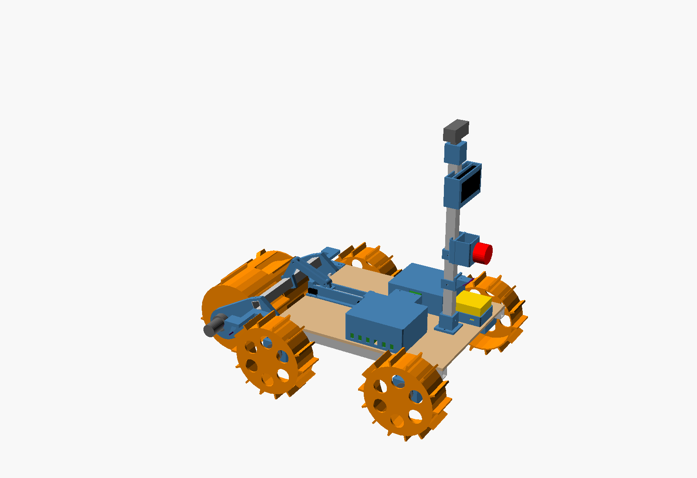

# Rover v1 — design and build guide

v1 is a small (~7.5 kg) four-wheel rover with a **rotating bucket drum** on a lift
arm. It digs by lowering the spinning drum while creeping forward, carries sand
inside the drum with the arm raised, and dumps by spinning the drum backwards over
the berm target.

## Why a drum (decided 2026-09-28)

- **A light rover can't shove.** A front bucket fills by pushing into the sand, which
  needs traction a ~10 kg rover doesn't have. A drum takes many small bites as it
  spins, so it needs far less push. This is the idea behind NASA's RASSOR.
- **One part digs, carries and dumps.** Spiral baffles inside carry the sand to the
  core; reversing the drum pours it out. No tipping linkage.
- **Proven and printable.** The 2026 Lunabotics champion (UVA) used a rotating drum,
  and a 3D-printed PLA drum dug ~778 kg/h in Tohoku University's sandbox tests.

## Key numbers (from `cad/rover.scad`; mass is an estimate)

| | |
|---|---|
| Stowed size | 632 × 440 × 581 mm (limit 1500 × 750 × 750) |
| Mass | ~7.5 kg empty, ~9.6 kg with a full drum |
| Centre of gravity | 60 % on the front axle empty, 80 % loaded |
| Drum | 160 mm shell, 180 mm over the teeth, 200 mm long, 8 scoops; ~3.6 L gross, ~1.4 L usable |
| Arm range | −25° (pressing in) / −20° (digging, teeth ~8 mm below grade) / +35° (carrying, teeth 111 mm up) |
| Lift actuator | M8 lead screw, 83 mm stroke, ~6 mm/s with a 300 RPM motor, self-locking |
| Ground clearance | ~70 mm under the motor clamps on firm ground |
| Printed parts | 29 part types, ~2.6 kg PETG, all fit a 220 × 220 mm bed, no supports |

## Files

| File | What it is |
|---|---|
| `cad/rover.scad` | Full assembly — open in OpenSCAD. Set `lift` to see other arm poses; the console prints size, mass and CG. |
| `cad/params.scad` | Every shared dimension. Change things here. |
| `cad/wheel.scad`, `drum.scad`, `arm.scad`, `actuator.scad`, `frame.scad`, `electronics.scad` | The parts. |
| `cad/print.scad` + `cad/stl/` | Every printed part in print orientation; STLs ready to slice. |
| `cad/rover_v1.FCStd`, `cad/rover_v1.step.zip` | The assembly for FreeCAD / Onshape / any CAD (mesh-derived, for viewing and measuring). |
| `cad/check_interference.py` | Checks every part group for collisions at four arm angles. Run after any change. |
| `cad/export.py`, `cad/export_freecad.py` | Regenerate the STLs and pictures, and the FreeCAD/STEP files. |

After changing anything: `python3 check_interference.py && python3 export.py`.

## 1. Measure first

The Johnson motor dimensions come from shop listings. Before printing clamps and hubs,
measure one motor and update `params.scad` (`jm_*`): gearbox diameter and length, can
diameter, shaft diameter and flat, shaft length, and **how far the shaft sits off the
gearbox centre** (`jm_shaft_off`). Then print one wheel hub slice to tune `clearance`.

## 2. Cut and drill

20 × 20 × 1.5 mm aluminium square tube (buy a 3 m length):

| Piece | Qty | Length | Holes |
|---|---|---|---|
| Side rail | 2 | 420 mm | Ø8.5 horizontal pivot hole 11 mm from the front end, mid-height. Ø4.5 vertical at 135 and 165 mm from the centre each way (motor clamps). Ø4.5 vertical 26 and 19 mm from the front end (sensor plate). |
| Cross member | 2 | 260 mm | Ø4.5 vertical 10 mm from each end (motor clamps), two Ø4.5 at ±17 mm from the centre on the rear one (mast base). |
| Crossbar | 1 | 256 mm | Ø4.5 vertical 6 mm from each end (arm bolts), one in the centre (lever). |
| Mast | 1 | 380 mm | Ø4.5 cross holes for the base and three collars (drill through the printed parts as a guide). |

Deck: 6 mm plywood, 388 × 300 mm. The front edge stops 32 mm short of the rail ends,
so the drum clears it. Drill through the printed parts as templates.

## 3. Print (PETG, 3–4 walls, 20–25 % gyroid, no supports)

`python3 export.py` prints the list with sizes and estimated grams. Quantities:

| Part | Qty | Notes |
|---|---|---|
| wheel | 4 | Outer face down. |
| drive_clamp_roof / _cap | 4 + 4 | Roof face down; M4 inserts in the roof face. |
| drum_body | 1 | Stands on its end plate, ~196 mm tall; the longest print (~20 h). **Print this first and test it (see §6).** |
| drum_cap, drum_drive_hub | 1 + 1 | Flat. |
| arm_drive, arm_idler | 1 + 1 | Flat; the bearing pocket faces up. |
| lever, pushrod_link | 1 + 2 | Flat. |
| act_channel, act_bearing_block, act_carriage, act_clamp_roof / _floor | 1 + 2 + 1 + 1 + 1 | |
| ebox_base, ebox_lid, driver_hood, battery_tray | 1 each | |
| mast_base, mast_collar_estop / _pzem / _tof, estop_box, pzem_holder, camera_pan_mount | 1 each | |
| tof_plate_left, tof_plate_right, tof_wedge | 1 each | Plates print upside down (flat top on the bed). |
| idler_spacer | 1 | |

## 4. Hardware

- **Bearings:** 5 × 608 (2 arm pivots, 1 drum idler, 2 lead screw).
- **M8:** 1 m threaded rod (cut 173 mm), 2 × M8×50 pivot bolts, 1 × M8×40 idler bolt, ~8 nuts, ~10 washers.
- **M5:** 2 × M5×30 + nylock nuts (pushrod pins).
- **M4:** ~25 × M4×35, ~20 × M4×12–16, 2 × M4×40, 1 × M4×50, nuts and washers. ~30 M4 heat-set inserts.
- **M3:** 20 × M3×45 + nuts (clamp pinch bolts, 4 per clamp); 5 × M3 grub screws + nuts (wheel and drum hubs).
- **Other:** 6 → 8 mm shaft coupler, 2 micro limit switches.

## 5. Assembly order

1. **Frame:** rails + cross members on a flat table. Hang the four drive motors in their
   clamps under the corners, with the shafts pointing outwards and the offset shaft
   **below** the gearbox centre. Bolt deck + rail + clamp together with M4×35 into the inserts.
2. **Wheels:** push onto the D-shafts, tighten the grub screws on the flats.
3. **Actuator:** bearing blocks, channel and motor clamp on the deck centre line. Lock
   the rod to each bearing's inner race with a nut on both sides. Carriage nut drops in
   from the top.
4. **Arms and drum:** press the 608s into the arm roots. Slide the crossbar through both
   arms and bolt it, then add the lever. Bolt the drive hub and cap to the drum. The drum
   motor's gearbox goes through the left arm and is pinched by the M4 bolt; the idler
   side uses the M8 bolt, spacer and cap bearing. Hang the arms on the M8 pivot bolts
   through the rails.
5. **Pushrods:** two links between the carriage ear and the lever with M5 pins. Set the
   limit switches at the ends of travel: arm +35° (up) and −25° (press).
6. **Electronics:** mast base on the rear cross member, collars for the E-stop (≈160 mm
   above the deck), PZEM (≈290 mm, display facing back, high and visible as the rules
   require) and rear ToF. Camera and pan servo on top. ToF plates on the front rail ends.
7. **Power path:** battery → PZEM shunt → E-stop → relay/contactor → main fuse → the
   four BTS7960 drivers and the 5 V buck (Pi 5). Put a fuse on every branch.

## 6. First tests (in this order)

1. **Drum on a stick:** mount the drum + motor on a hand-held jig in the sand pit. Check
   that it fills (~1.4 L) while you drag it forward at ~2–3 cm/s, holds sand when
   lifted, and empties within ~25 s when reversed. Measure the motor current. If it
   stalls, switch to the 10 RPM Johnson (same mount).
2. **Mobility:** chassis + wheels + ~5 kg on board. Drive in loose sand, turn in place,
   and climb out of a dug hole. Try 2–3 grouser variants (`wheel.scad`).
3. **Lift:** actuator + arm with a 3 kg load: full stroke both ways, the limit switches
   work, and the arm holds position with the power off.
4. **Full teleop cycle:** dig → carry → dump, driving from the onboard camera only.

## 7. Known issues and next steps

- **Front-heavy when loaded** (80 % on the front axle): watch for rear-wheel skid when
  turning with a full drum. Carry low, keep the battery rearmost, and consider a small
  rear ballast only if needed (mass costs score).
- **Drum motor torque is the biggest unknown.** It's estimated from papers, not measured.
  Test 1 settles it.
- **Wheels hang on the gearbox shafts** (no outboard bearings in v1). If they wobble or
  wear, set `use_bearing = true` in `wheel.scad` and add outer brackets.
- **Front ToF sensors may see the drum motor in the dig pose.** Mask that zone in
  firmware; they have a clear view while travelling with the drum up.
- **In FreeCAD, the drum object reports "invalid"** (its thin baffles don't survive the
  mesh conversion). It displays and measures fine, but edit the OpenSCAD files, not the
  FreeCAD copy.
